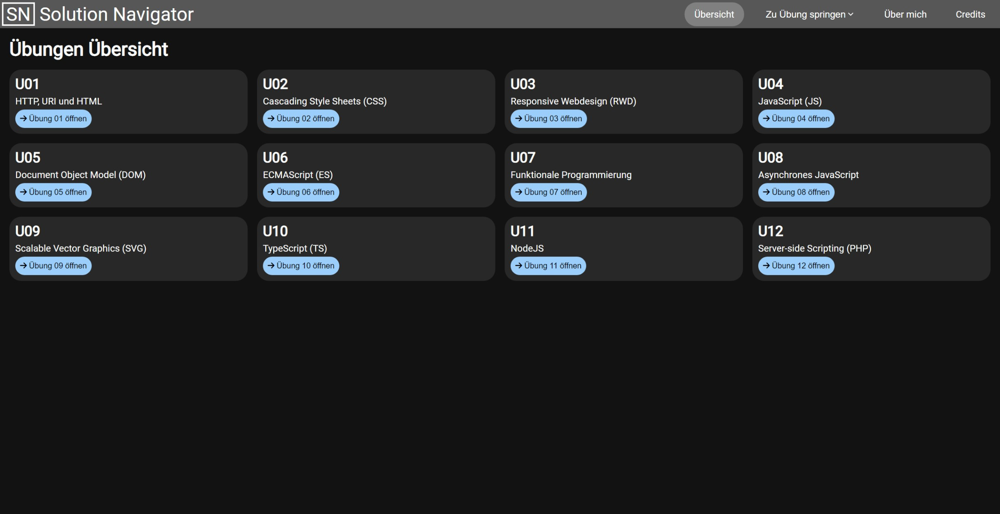
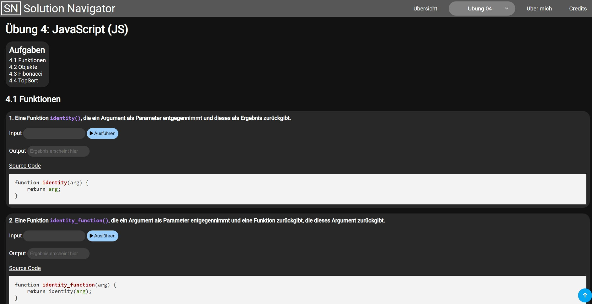
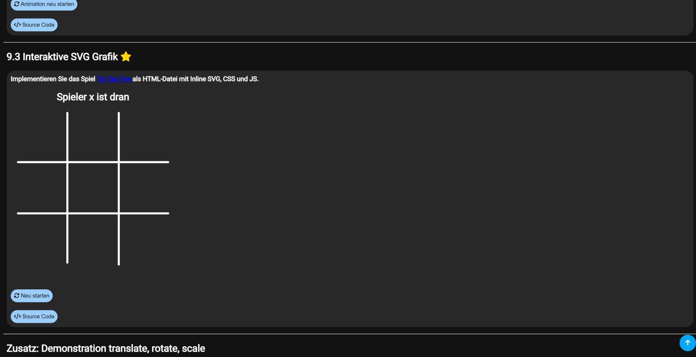

# WESolutionNavigator

## Beschreibung / Description

Diese Website ist als fortlaufendes Semesterprojekt während des Kurses "Web Engineering" im Wintersemester 23/24 entstanden. Sie diente zum einen dazu, die Ergebnisse zu den Übungen übersichtlich darzustellen und sollte gleichzeitig auch als praktische Anwendung der im Kurs behandelten Technologien wie HTML, CSS und JavaScript dienen.

This website was created as an ongoing semester project during the "Web Engineering" course in the winter semester of 23/24. It was designed to clearly present the results of the exercises, while also serving as a practical application of the technologies covered in the course, such as HTML, CSS, and JavaScript.

## Vorschau / Preview

***

***

